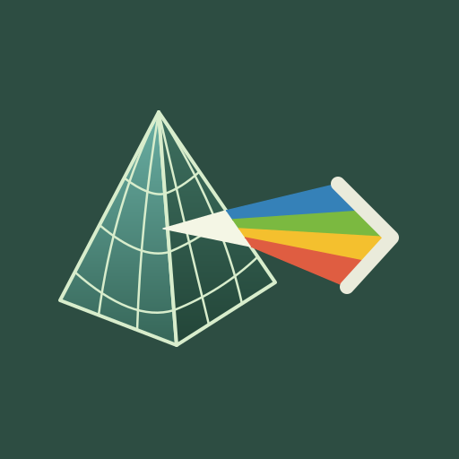

<p align="center">
  
</p>

<h1 align="center">Prism</h1>

<p align="center">
  <i>A web app manager and creator that actually turns them into apps.</i>
</p>

<div align="center">

[](https://github.com/sponsors/XDanfr)
[](https://discord.gg/fuxMAVBccK)

[](https://github.com/XDanfr/Prism/releases/latest)
[](https://github.com/XDanfr/Prism/releases)

</div>

---

<p align="center">
  <i>Placeholder for screenshot</i>
</p>

## ✨ Features

* **On-Device APK Compilation:** Converts non-PWA sites and web tools directly into standalone Android APKs without relying on any external servers or tools on a PC.
* **Low-Level Binary Patching:** Modifies compiled `AndroidManifest.xml` binary XML structures via AXML and synchronizes package headers inside `resources.arsc` to guarantee clean resource resolution on launch.
* **Material You Dynamic Icon Engine:** Extracts web icons or accepts user-uploaded SVGs/PNGs to auto-generate standard foreground layers alongside `<monochrome>` vector layers for Android 13+ dynamic wallpaper tinting.
* **Cryptographically Valid Signing Pipeline:** Executes a strict byte-level compilation chain (`Patch` -> `Zip` -> `ZipAlign` -> `v2/v3 Sign`) using an embedded `apksigner` engine before handing off the package to Android's `PackageInstaller`.
* **Deep Customization Controls:** Customize app identity down to reverse-DNS package names (e.g., `com.pwa.backloggd`), custom app labels, squircle container colors, desktop User-Agents, and container execution modes (Embedded WebView vs. Chrome Custom Tabs).
* **Material 3 Expressive UI:** Built natively using Jetpack Compose using the beautiful M3 Expressive design! Part of [Axis](https://github.com/XDanfr/Axis)

## 🚀 Getting Started

### Quick Install (Recommended)
[](https://github.com/XDanfr/Prism/releases/latest)

### Or: Build from Source
See [🛠️ Building & Development](#️-building--development)

---

## ⚙️ How It Works

Prism bypasses standard WebAPK browser restrictions by bundling a minimal base Android application template and modifying its binary payload directly on your device:


```text
[ Target URL & Metadata ]
│
▼
[ Base Template APK ] ──► [ AXML & ARSC Sync ] ──► [ Asset / Icon Injection ]
│
▼
[ System App Drawer Entry ] ◄── [ PackageInstaller ] ◄── [ ZipAlign & Sign ]
```

1. **Ingest & Extract:** Prism fetches the site's manifest or favicon and accepts custom configuration choices (Package Name, Title, Icon, Engine Mode).
2. **Patch Binary Metadata:** Updates the package identity across both the binary XML manifest and the `resources.arsc` table headers.
3. **Inject Assets:** Injects generated adaptive XML layers (`ic_launcher.xml`, `<monochrome>`) and configuration mappings into the archive.
4. **Align & Sign:** Aligns the zip boundaries to 4-byte offsets (`ZipAlign`) and cryptographically signs the archive using an on-device local keystore via `apksigner`.
5. **System Hand-off:** Triggers Android's native `Intent.ACTION_VIEW` installer, making the generated web app visible in your main launcher app drawer like any native app.

---

## 🏗️ Technical Architecture

* **UI Layer:** Jetpack Compose with `@OptIn(ExperimentalMaterial3ExpressiveApi::class)`
* **Navigation & State:** Jetpack Navigation 3 state-driven flows & Kotlin Coroutines
* **Responsive Layouts:** Compose Material Adaptive (Phone, Foldable, Tablet support)
* **Binary Processing:** Custom AXML parsing, binary resource table (`resources.arsc`) string modifications, and `java.util.zip` / `Zip4j` file streams
* **Cryptographic Signer:** Ported Android SDK `apksigner` supporting APK Signature Scheme v2/v3

---

## 🛠️ Building & Development

### Prerequisites
* **Android Studio** (Latest stable build)
* **JDK 17** or higher
* **Android SDK** API level 35+

### Build Steps
1. Clone the repository:
   ```bash
   git clone https://github.com/XDanfr/Prism.git
   cd Prism
   ```
2. Open the project in Android Studio.
3. Sync Gradle dependencies (`build.gradle.kts` uses Kotlin DSL out of the box).
4. Build and run on a physical device or emulator running **Android 7.0 (API 24)** or higher:

```bash
./gradlew assembleDebug
```

---

## 📜 License

Distributed under the **GNU General Public License v3.0**. See [`LICENSE`](./LICENSE) for more information.
